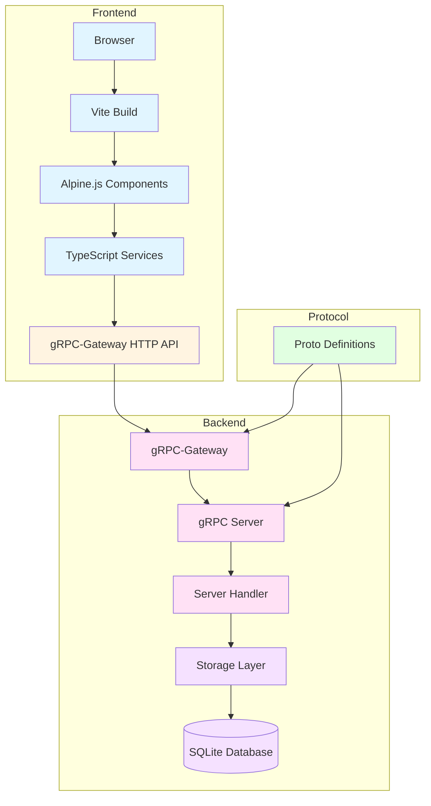
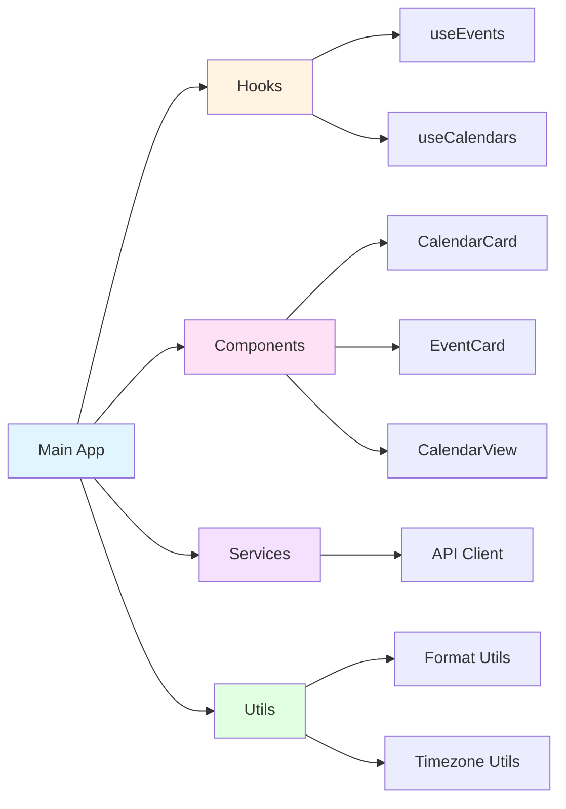
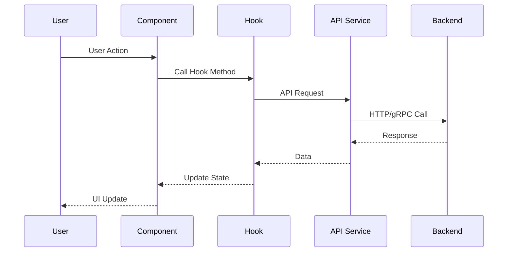
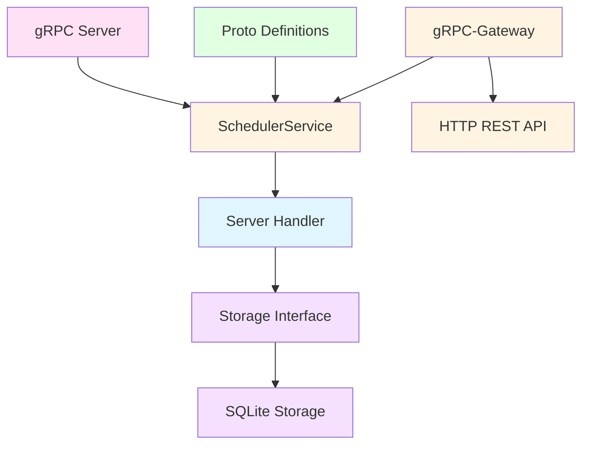
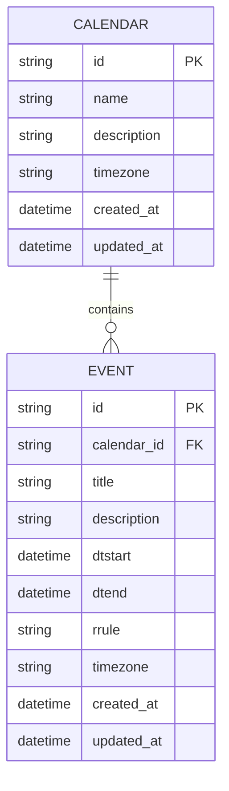
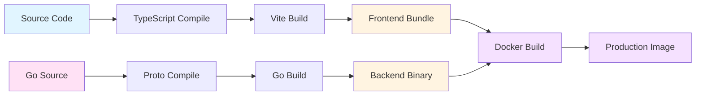
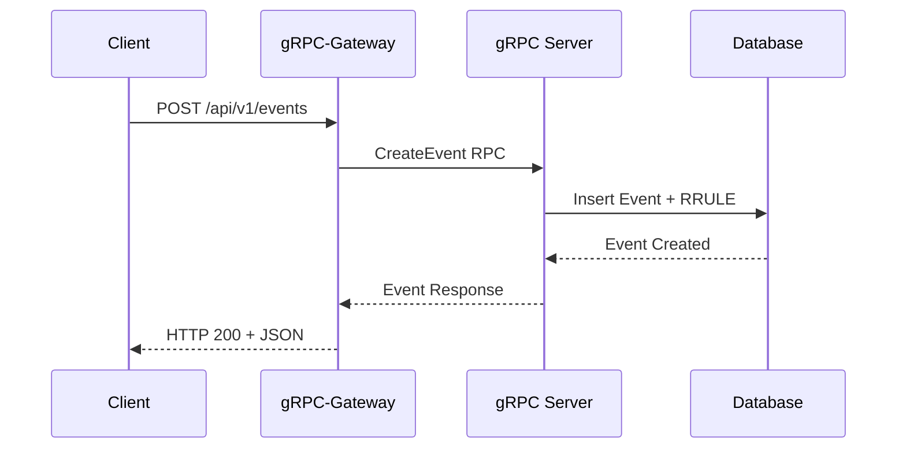
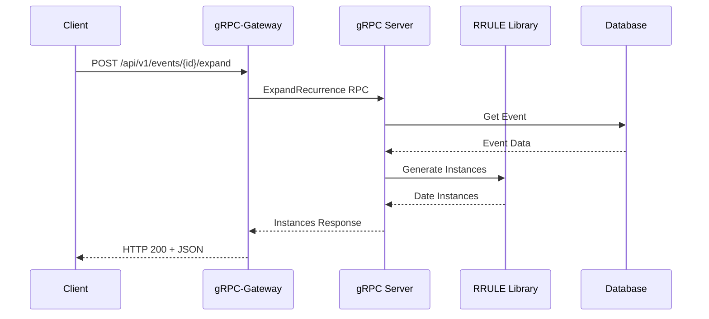
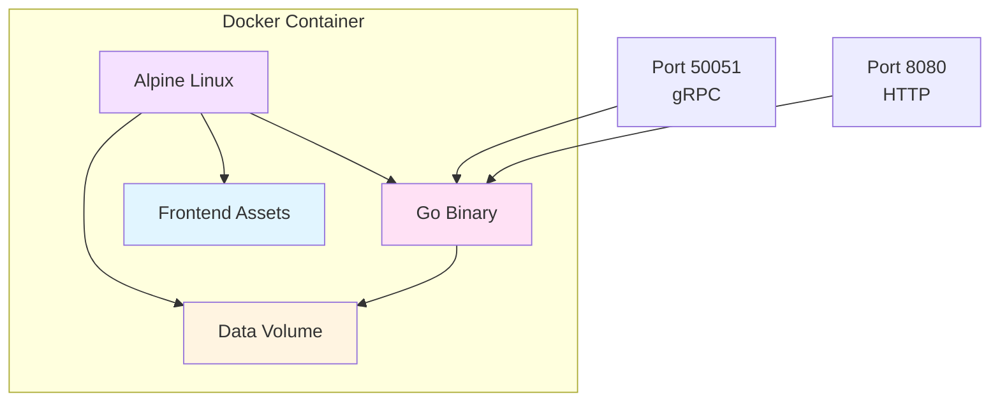

# Architecture Documentation

## Overview

Recurrence Scheduler is a RFC 5545 compliant calendar and event management system with gRPC backend and modern TypeScript frontend.

## System Architecture

## Frontend Architecture

### Component Structure

### Data Flow

## Backend Architecture

### Service Layer

### Storage Layer

## Technology Stack

### Frontend

- **TypeScript**: Type-safe JavaScript
- **Vite**: Fast build tool
- **Alpine.js**: Lightweight reactive framework
- **Tailwind CSS**: Utility-first CSS framework

### Backend

- **Go 1.23+**: Programming language
- **gRPC**: High-performance RPC framework
- **gRPC-Gateway**: HTTP REST API gateway
- **SQLite**: Lightweight database

### Protocols

- **Protocol Buffers**: Interface definition
- **RFC 5545**: iCalendar standard compliance

## Component Details

### Hooks

#### useEvents

Manages event state and operations:
- `load(calendarId, start, end)`: Load events for date range
- `create(request)`: Create new event
- State: `events`, `loading`, `error`

#### useCalendars

Manages calendar state and operations:
- `load()`: Load all calendars
- `create(request)`: Create new calendar
- `getById(id)`: Get calendar by ID
- State: `calendars`, `loading`, `error`

### Components

#### CalendarCard

Displays calendar information card:
- Calendar name and description
- Timezone and ID display
- Click handler for detail view

#### EventCard

Displays event information:
- Formatted start/end dates
- Recurrence rule display
- Event description

#### CalendarView

Monthly calendar grid view:
- 7-day week grid
- Event badges on dates
- Month navigation
- Today highlighting

### Services

#### API Client

REST API client wrapper:
- `listCalendars()`: Get calendars
- `createCalendar()`: Create calendar
- `listEvents()`: Get events
- `createEvent()`: Create event
- `expandRecurrence()`: Expand recurring events

## Build Process

## API Flow

### Create Event with Recurrence

### Expand Recurrence

## Deployment Architecture

## Security Considerations

- All packages use MIT or Apache 2.0 licenses
- No sensitive data in codebase
- Environment variables for configuration
- SQLite database stored in persistent volume

## Performance

- Lightweight Alpine Linux base image
- Single binary deployment
- Static frontend assets
- Efficient SQLite queries
- gRPC for high-performance inter-service communication
